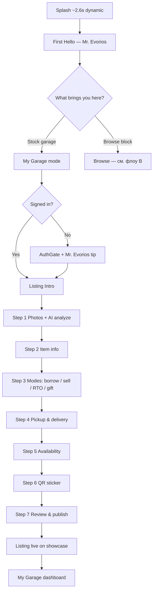
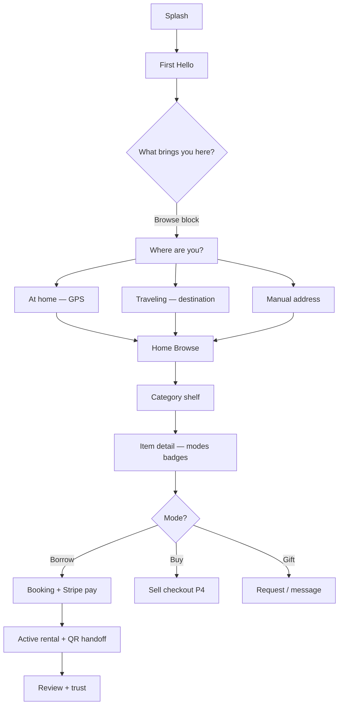

# Evorios — концепция приложения и флоу

**Бренд:** [EVORIOS.md](EVORIOS.md) · **Garage Showcase:** [GARAGE_SHOWCASE.md](GARAGE_SHOWCASE.md) · **Аудит экранов:** [FLOW_AUDIT.md](FLOW_AUDIT.md)

**Last updated:** 2026-06-16

---

## Одна фраза

> **Evorios** (Эвориос) — эволюция домашнего хозяйства: каждый дом на квартале открывает **витрину гаража** (Garage Showcase), соседи берут в аренду, покупают или забирают рядом.

**Маскот:** **Mr. Evorios** (Мистер Эвориос) — сосед-наставник в зелёном костюме; голос в подсказках, чате и FAQ.

**Слоган (EN UI):** *The evolution of your household.*

**Слоган (RU, для маркетинга):** *Эволюция вашего домашнего хозяйства.*

---

## Как должно выглядеть приложение

### Визуальный язык

| Элемент | Направление |
|--------|-------------|
| **Фон** | Светлый пригородный (белый / `#eef2ea`), не «техно-сетка» |
| **Акцент** | Зелёный Evorios `#0D5C3A`, янтарь `#F59E0B` для акцентов |
| **Шапка** | **Evorios™** по центру на всех основных экранах |
| **Метафора** | Гараж, крыльцо, квартал — не «маркетплейс» и не «соцсеть аренды» |
| **Карточки** | Полки витрины / «гараж соседа», а не безликий каталог |
| **Маскот** | Mr. Evorios в чате, подсказках, пустых полках — не «Rentano» |

### Домашняя страница (Home)

**Спека (согласовано):** [HOME_REDESIGN.md](HOME_REDESIGN.md)

Home = **окно на квартал**, без переключателя My Garage / Browse.

| Слой | Содержание |
|------|------------|
| **Search-hero** | «What do you need?» — семантический поиск (P2), сейчас keyword |
| **Чипсы** | All · Rent · Buy · Gift — фильтры, не ворота |
| **Линзы** | **Feed** (default) · **Garages** · Map (Stage 2) |
| **Карточка** | Вещь + цена + **доверие** (гараж · ⭐ · mi) |
| **Nav** | Home · Search · **＋** · Garage · Mr.E |

**My Garage** — отдельная вкладка **Garage** (витрина, брони, CTA stock). Настройки — gear в Garage → Profile.

**Онбординг:** Splash → Hello → блок → сразу Feed (без «What brings you here»).

---

## Флоу A — хозяин гаража (регистрация витрины)

Человек хочет **выставить вещи** из гаража: аренда, продажа, RTO, дар.

| # | Экран | Цель | Mr. Evorios |
|---|--------|------|-------------|
| 1 | Splash | Бренд + слоган, быстро | — |
| 2 | First Hello | Знакомство с Garage Showcase | 3 пузыря чата |
| 3 | What do you want | **Stock your garage** vs Browse | — |
| 4 | Auth (если нужно) | Сохранить черновик листинга | Подсказка в AuthGate |
| 5 | Listing Intro | 7 шагов = полка на витрине | Hint |
| 6–12 | Wizard 1–7 | Фото → инфо → цены → выдача → QR | Hint на каждом шаге |
| 13 | Publish success | Конфетти, share card | — |
| 14 | Home (My Garage) | Управление витриной | Чат по центру nav |

**Ключевые решения UX:**

- Onboarding **earn** можно укоротить: сразу в wizard после выбора «Stock garage»
- Verification photo перед «go live» — Mr. Evorios объясняет зачем
- Stripe Connect — выплаты хозяину (уже в коде на main)

---

## Флоу B — сосед (аренда / покупка / просмотр)

Человек ищет **вещь на квартале**: одолжить, купить б/у, RTO, подобрать подарок.

| # | Экран | Цель |
|---|--------|------|
| 1–2 | Splash, Hello | Как во флоу A |
| 3 | What do you want | Выбор **Browse the block** |
| 4 | Where are you | Локация для «гаражей рядом» |
| 5 | Home Browse | Категории, поиск, карточки |
| 6 | Subcategory | Полка категории; пусто → Post request |
| 7 | Item detail | Borrow · Buy · RTO · Gift badges |
| 8 | Booking | Даты, депозит, Stripe |
| 9 | Active rental | QR, чат, продление, спор |
| 10 | Profile / Rentals | История |

**Ключевые решения UX:**

- Карточка товара = **полка в гараже соседа** (имя, расстояние, рейтинг блока)
- Режимы только **бейджами**, не жаргоном «rent/sell»
- Mr. Evorios на пустой полке: «Ask neighbors» / post request

---

## Флоу C — общие пути

| Сценарий | Путь |
|----------|------|
| Установка PWA | Mr. Evorios nav → Install app |
| Помощь | Mr. Evorios → FAQ или чат (знает экран и шаг wizard) |
| Сообщения | Notifications → Messages |
| Спор | Active rental → Dispute + Mr. Evorios guide |
| Повторный вход | Splash пропускается если `intro_done`; `?screen=splash` для превью |

---

## Splash — три режима (dev)

| URL | Назначение |
|-----|------------|
| Обычный запуск | **Динамика** ~2.6s: иконки → **Evorios** → слоган → онбординг |
| `?screen=splash&dynamic=1` | Превью анимации без автоперехода |
| `?screen=splash` | Статичный макет (картинка + надписи) |
| `?screen=splash&art=1` | Только PNG `evorios_splash_garage.png` |

---

## Фазы продукта (приоритет)

| Фаза | Что |
|------|-----|
| **Сейчас** | Строки Evorios, Mr. Evorios, динамический splash, brand.ts |
| **P2** | Home = neighborhood garages; onboarding картинки |
| **P3** | Item detail = shelf; sell checkout |
| **P4** | evorios.com лендинг (3 столпа эволюции) |
| **P5** | Новый арт маскота и иконки PWA |

---

## Три столпа эволюции (для лендинга и онбординга)

1. **Домашнее хозяйство** — от «хлама в гараже» к «мой дом делится»
2. **Потребление** — аренда, покупка б/у, RTO, передача вещи в одном месте
3. **Отношения** — анонимный маркетплейс → соседи, крыльцо, доверие на квартале

---

*Обновляйте этот документ при смене флоу или макета Home.*
